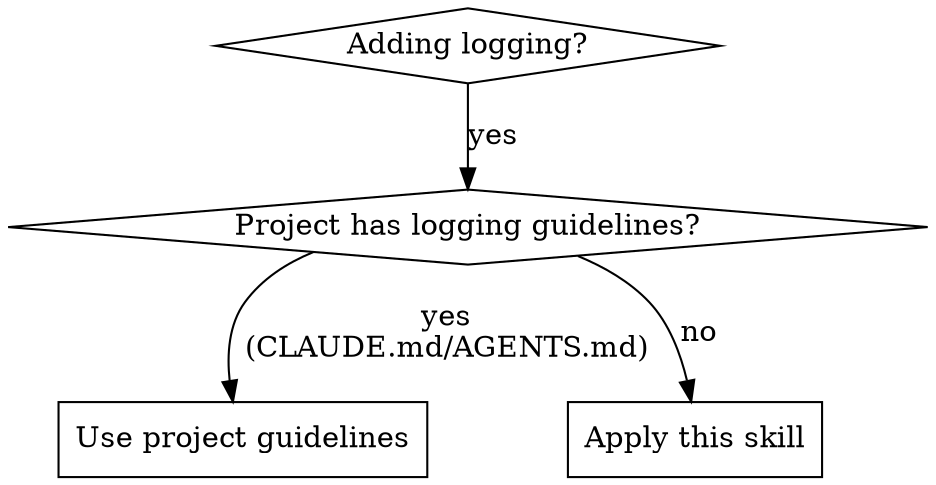

# Logging Standards

## Overview

Structured JSON logging with context for observability. Always include relevant identifiers.

## When to Use

**Check first:** Look for logging section in CLAUDE.md or AGENTS.md. If present, follow project guidelines instead.

## Core Principles

See @standards.md for context fields and patterns.

**Key principles:**
- Structured JSON logs (machine-parseable)
- Always include context identifiers
- Levels matter: debug/info/warn/error have distinct semantics
