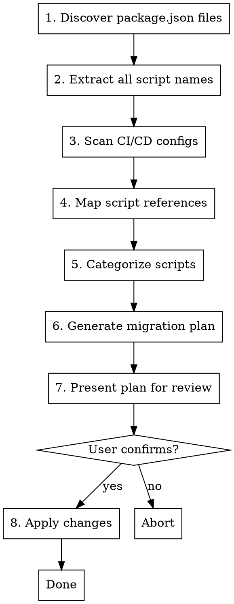

# Standardize npm Scripts

## Overview

Analyze and standardize npm script naming conventions across multiple repositories or packages. Produces a migration plan with CI/CD impact analysis before any changes.

## When to Use

- Onboarding to a monorepo with inconsistent script naming
- Consolidating multiple repos under unified conventions
- Preparing repos for shared CI/CD pipelines
- Auditing script naming before a major refactor

**Don't use when:**
- Single package with already-standard scripts
- Scripts are intentionally non-standard (documented reasons)

## Standard Naming Convention

| Script | Purpose |
|--------|---------|
| `dev` | Development server with hot reload |
| `build` | Production build |
| `build:watch` | Build with file watching |
| `build:dev` | Development build (unminified) |
| `lint` | Run linter (includes formatting checks) |
| `lint:fix` | Fix all linting and formatting issues |
| `typecheck` | TypeScript type checking |
| `test` | Run tests |
| `test:watch` | Run tests in watch mode |
| `test:coverage` | Run tests with coverage |
| `test:e2e` | End-to-end tests |
| `validate` | Run all checks (lint + typecheck + test) |
| `clean` | Remove build artifacts |
| `start` | Start production server |
| `prepare` | Git hooks setup (husky, etc.) |

**Formatting:** Use ESLint for both linting and formatting (via stylistic rules or prettier plugin). One tool, one command (`lint:fix`), fewer decisions. Only add separate `format` scripts if the team explicitly requires standalone Prettier workflows.

## Workflow



## Phase 1: Discovery

Find all package.json files in target directory:

```bash
find . -name "package.json" -not -path "*/node_modules/*" -not -path "*/.git/*"
```

For each package.json, extract:
- Package name
- All script names and their commands
- Path relative to root

## Phase 2: CI/CD Analysis

Scan for CI/CD configuration files:

| File Pattern | System |
|--------------|--------|
| `.github/workflows/*.yml` | GitHub Actions |
| `.gitlab-ci.yml` | GitLab CI |
| `Jenkinsfile` | Jenkins |
| `.circleci/config.yml` | CircleCI |
| `azure-pipelines.yml` | Azure DevOps |
| `bitbucket-pipelines.yml` | Bitbucket |
| `.travis.yml` | Travis CI |
| `Makefile` | Make (often wraps npm) |
| `README.md`, `CONTRIBUTING.md` | Documentation |
| `docs/**/*.md` | Documentation |
| `*.md` (root) | Documentation |

For each config/doc file, extract npm/yarn/pnpm script invocations:
- `npm run <script>`
- `yarn <script>`
- `pnpm <script>`
- `npx <command>` (may invoke scripts)

## Phase 3: Script Categorization

Map discovered scripts to standard names:

| Category | Common Variants | Standard Name |
|----------|-----------------|---------------|
| Dev server | `start:dev`, `serve`, `dev:server`, `develop` | `dev` |
| Build | `compile`, `bundle`, `dist` | `build` |
| Lint | `linter`, `eslint`, `check:lint` | `lint` |
| Format | `prettier`, `fmt`, `prettify` | merge into `lint` |
| Type check | `tsc`, `types`, `check:types`, `ts` | `typecheck` |
| Test | `jest`, `vitest`, `mocha`, `spec` | `test` |
| Clean | `clear`, `reset`, `purge` | `clean` |

**Ambiguous scripts require human decision:**
- `check` - could be lint, typecheck, or validate
- `verify` - could be test or validate
- Custom domain scripts (keep as-is)

## Phase 4: Migration Plan

Generate a structured report:

```markdown
# npm Script Standardization Plan

## Summary
- Packages analyzed: N
- Scripts to rename: N
- CI/CD references found: N
- Breaking changes: N

## Changes by Package

### package-name (path/to/package)

| Current | Proposed | CI/CD Impact |
|---------|----------|--------------|
| `linter` | `lint` | .github/workflows/ci.yml:23 |
| `start:dev` | `dev` | None |

### another-package (path/to/another)
...

## CI/CD Updates Required

### .github/workflows/ci.yml
- Line 23: `npm run linter` → `npm run lint`
- Line 45: `yarn linter` → `yarn lint`

## Documentation Updates Required

### README.md
- Line 12: `npm run start:dev` → `npm run dev`

### CONTRIBUTING.md
- Line 45: `yarn linter` → `yarn lint`

## Scripts Kept As-Is
- `deploy` (domain-specific)
- `db:migrate` (domain-specific)

## Ambiguous Scripts (Require Decision)
- `check` in package-a: lint? typecheck? validate?
```

## Phase 5: Apply Changes

Only after explicit user confirmation:

1. Update each package.json script name
2. Update CI/CD config files
3. Update documentation files
4. Verify no broken references remain

**Never auto-apply.** Always show the full plan and wait for confirmation.

## Common Mistakes

| Mistake | Prevention |
|---------|------------|
| Missing CI/CD references | Always scan ALL CI config patterns |
| Missing doc references | Scan README, CONTRIBUTING, docs/*.md |
| Renaming domain scripts | Only rename scripts matching known categories |
| Breaking pre/post hooks | Check for `pre<script>` and `post<script>` dependencies |
| Missing workspace scripts | In monorepos, check root AND package scripts |
| Ignoring Makefile | Make often wraps npm scripts |

## Edge Cases

**Workspaces (pnpm/yarn/npm):**
- Root package.json may have workspace-wide scripts
- Individual packages may override
- Check for `workspace:*` protocol usage

**Pre/post hooks:**
- `pretest`, `postbuild`, etc. auto-run
- If renaming `test` to something else, `pretest` breaks
- Standard names preserve hook behavior

**Script references in code:**
- `child_process.exec('npm run old-script')`
- Search codebase for script invocations

## Output Format

Present the migration plan in markdown. Group changes by:
1. Safe changes (no CI/CD impact)
2. Changes requiring CI/CD updates (list exact files/lines)
3. Ambiguous scripts (need human decision)
4. Scripts kept as-is (with reasoning)
