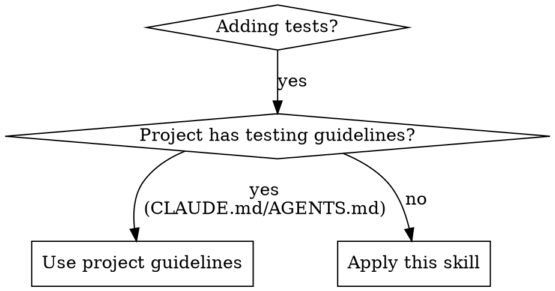

# Testing Strategy

## Overview

Tests verify user-visible behavior or prevent specific regressions. Not for coverage sake.

## When to Use

**Check first:** Look for testing section in CLAUDE.md or AGENTS.md. If present, follow project guidelines instead.

## Core Philosophy

See @guidelines.md for the full checklist and examples.

**Key principle:** If `tsc`/lint/static analysis already validates it, don't add a unit test just to have one.
