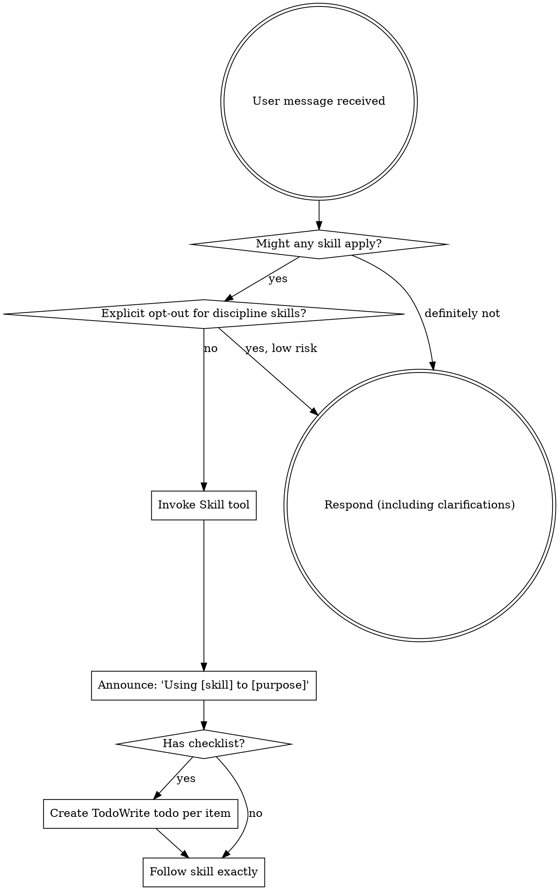

<EXTREMELY-IMPORTANT>
If you think there is even a 1% chance a skill might apply to what you are doing, you ABSOLUTELY MUST invoke the skill.

IF A SKILL APPLIES TO YOUR TASK, YOU DO NOT HAVE A CHOICE. YOU MUST USE IT.

This is not negotiable. This is not optional. You cannot rationalize your way out of this.
</EXTREMELY-IMPORTANT>

## How to Access Skills

**In Claude Code:** Use the `Skill` tool. When you invoke a skill, its content is loaded and presented to you—follow it directly. Never use the Read tool on skill files.

**In other environments:** Check your platform's documentation for how skills are loaded.

# Using Skills

## The Rule

**Invoke relevant or requested skills BEFORE any response or action, unless an explicit opt-out applies.** If an invoked skill turns out to be wrong for the situation, you don't need to use it.

## Process Gating (Lightweight Default)

Default to a lightweight flow. Only invoke discipline/process skills when the user explicitly requests strict process or when the risk is high.

**Explicit opt-out signals (skip discipline skills):**
- "fast path"
- "skip process"
- "no TDD"
- "no worktree"
- "lightweight"
- "finish without switching to strict process"
- "already started without TDD"
- "just implement now"

Treat any explicit request to skip or reduce process as an opt-out, even if phrased differently.

**High-risk triggers (override opt-out):**
- Production changes
- Security or auth
- Billing or financial impact
- Destructive/irreversible actions

When skipping a discipline skill, briefly acknowledge the opt-out and proceed with the minimal safe approach.

## Red Flags

These thoughts mean STOP—you're rationalizing:

| Thought | Reality |
|---------|---------|
| "This is just a simple question" | Questions are tasks. Check for skills. |
| "I need more context first" | Skill check comes BEFORE clarifying questions. |
| "Let me explore the codebase first" | Skills tell you HOW to explore. Check first. |
| "I can check git/files quickly" | Files lack conversation context. Check for skills. |
| "Let me gather information first" | Skills tell you HOW to gather information. |
| "This doesn't need a formal skill" | If a skill exists, use it. |
| "I remember this skill" | Skills evolve. Read current version. |
| "This doesn't count as a task" | Action = task. Check for skills. |
| "The skill is overkill" | Simple things become complex. Use it. |
| "I'll just do this one thing first" | Check BEFORE doing anything. |
| "This feels productive" | Undisciplined action wastes time. Skills prevent this. |
| "I know what that means" | Knowing the concept ≠ using the skill. Invoke it. |

## Rationalizations for Over-Enforcement

| Excuse | Reality |
|--------|---------|
| "I must always apply process skills, even when the user opts out" | Explicit opt-out means skip discipline skills unless risk is high. |
| "The flowchart says always invoke" | The opt-out gate is part of the rule now. Apply it. |
| "I can't move without TDD/worktrees" | You can proceed on a lightweight path when the user asks. |
| "They didn't use the exact opt-out words" | Treat explicit requests to skip/reduce process as opt-out. Exact phrasing is not required. |

## Skill Priority

When multiple skills could apply, use this order:

1. **Process skills first** (brainstorming, debugging) - these determine HOW to approach the task when invoked
2. **Implementation skills second** (frontend-design, mcp-builder) - these guide execution

"Let's build X" → brainstorming first, then implementation skills.
"Fix this bug" → debugging first, then domain-specific skills.

## Skill Types

**Rigid** (TDD, debugging): Follow exactly. Don't adapt away discipline.

**Flexible** (patterns): Adapt principles to context.

The skill itself tells you which.

## Quick Reference

| Situation | Action |
|-----------|--------|
| User requests "fast path" or "skip process" | Skip discipline skills; proceed minimally and safely |
| User explicitly requests TDD/worktree | Invoke that skill and follow it fully |
| High-risk change (prod/security/billing) | Invoke relevant discipline/safety skills even if opt-out |

## Common Mistakes

- Ignoring explicit opt-out phrases
- Treating opt-out as exact-match only
- Skipping skills on high-risk changes
- Failing to acknowledge the opt-out before proceeding

## User Instructions

Instructions say WHAT, not HOW. "Add X" or "Fix Y" doesn't mean skip workflows.
